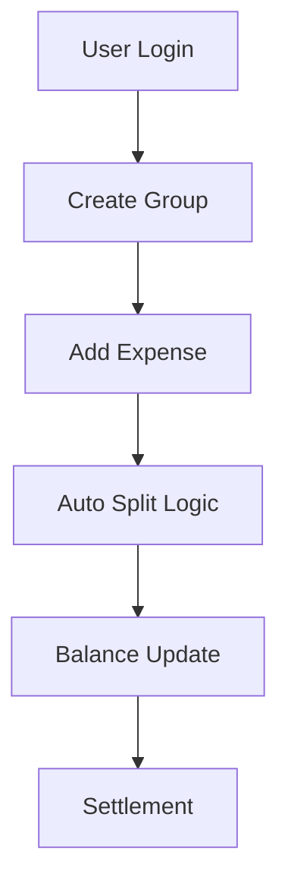

<!-- HERO SECTION -->

<p align="center">
  
</p>

<p align="center">
  
</p>

<p align="center">
  <b>🚀 Split expenses smarter. Not harder.</b>
</p>

---

<!-- BADGES -->

<p align="center">
  
  
  
  
  
</p>

<p align="center">
  
  
</p>

---

# 🤖 SplitSmart Pro — Expense Intelligence Platform

> A modern **expense management system** that simplifies group finances using **automation, real-time insights, and clean UI**.

---

## 🎥 Demo

<p align="center">
  
</p>

---

## 🎯 Problem

Managing shared expenses is:
- ❌ Confusing  
- ❌ Error-prone  
- ❌ Lacks transparency  

People struggle to track who paid what and who owes whom.

---

## 💡 Solution

SplitSmart Pro:
- ✅ Automates expense splitting  
- ✅ Tracks balances in real-time  
- ✅ Clearly shows debts  
- ✅ Provides analytics insights  

---

## ✨ Features

-  Group-based expense management  
-  Automatic bill splitting  
-  Analytics dashboard (charts & trends)  
-  Settlement system  
-  Smart search & filters  
-  Dark-themed UI  
-  Notifications & activity tracking  

---

## 🧩 Implemented Modules

- ✅ Authentication-ready structure  
- ✅ Expense calculation engine  
- ✅ Balance tracking system  
- ✅ Group management  
- ✅ Analytics dashboard  
- ✅ Responsive UI (mobile + desktop)  
- ✅ Deployment (Vercel + Render + MongoDB Atlas)  

---

## 🧠 System Flow



## 🛠️ Tech Stack

| Layer       | Technology                     |
|------------|-------------------------------|
| Frontend   | React, Tailwind CSS, Vite     |
| Backend    | Node.js, Express.js           |
| Database   | MongoDB Atlas                 |
| Deployment | Vercel, Render                |

---

## ⚙️ Installation

### 📥 Clone Repo
```bash
git clone https://github.com/your-username/splitsmartpro.git
cd splitsmartpro
```
---
## ⚙️ Backend Setup
cd backend
npm install

MONGO_URI=your_mongodb_connection
JWT_SECRET=your_secret
PORT=5000

npm run dev

---
##💻 Frontend Setup

cd frontend
npm install
npm run dev


## 🌐 Deployment

| Service   | Platform        |
|----------|----------------|
| Frontend | Vercel         |
| Backend  | Render         |
| Database | MongoDB Atlas  |

---

## 🔗 Live Links

- 🌐 Frontend: https://your-vercel-link.vercel.app  
- ⚙️ Backend: https://your-render-link.onrender.com  

---

## 🎨 Figma Design

 https://www.figma.com/design/8vl7farAdIv5FjltD1R1Uz/Untitled?node-id=47-2&t=BeMjVdGkfRBYFbSC-1

---

## 📊 Benefits

-  Eliminates manual calculations  
-  Accurate expense tracking  
-  Clear financial visibility  
-  Improves group transparency  
-  Fast settlements  

---

## 🔮 Future Scope

-  Payment integration (UPI / Razorpay)  
-  Real-time sync (WebSockets)  
-  Mobile app  
- AI-powered insights  

---

##  Why This Project Stands Out

- Clean UI/UX with dark theme  
- Real-world problem solving  
- Full-stack MERN deployment  
- Analytics + insights driven design  

---

## 👨‍💻 Author

**Vishwa Patel**

---

## ⭐ Support

If you like this project, give it a ⭐ on GitHub!

---

 
